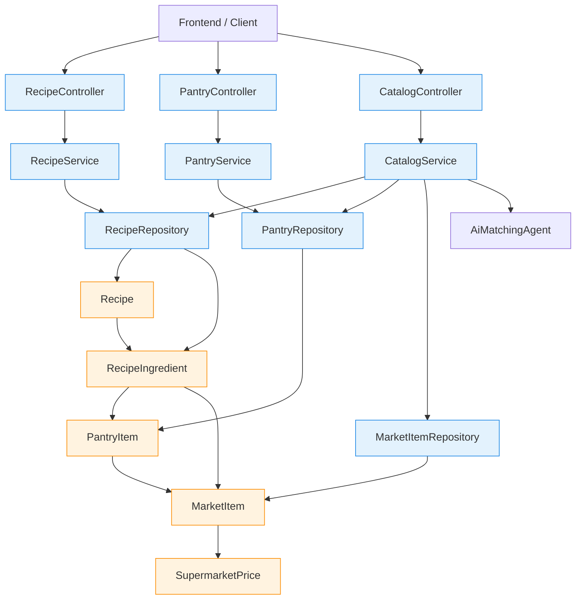

# Life Platform Backend Architecture

## High-level module map

## What each module does

### 1. Recipes module
- Purpose: manage recipes and check whether a recipe can be cooked from the current pantry.
- Main classes:
  - RecipeController: exposes REST endpoints for listing, creating, and checking recipe readiness.
  - RecipeService: validates recipe data and checks pantry availability.
  - RecipeRepository: reads and writes recipe records.
- Core flow:
  1. The client sends a request to /api/recipes.
  2. RecipeService loads the recipe and its ingredients.
  3. It compares each required ingredient against the pantry stock.
  4. It returns a status response saying whether the recipe is cookable and which ingredients are missing.

### 2. Pantry module
- Purpose: manage the user’s household inventory.
- Main classes:
  - PantryController: handles creating and reading pantry items.
  - PantryService: adds or updates quantities and prevents negative values.
  - PantryRepository: stores pantry records.
- Core flow:
  1. The client adds ingredients to the pantry.
  2. PantryService checks whether the ingredient already exists.
  3. If it exists, it increases the stored quantity; otherwise it creates a new pantry item.

### 3. Catalog module
- Purpose: connect recipes and pantry items to supermarket products and estimate shopping costs.
- Main classes:
  - CatalogController: exposes endpoints for budget planning and ingredient ingestion.
  - CatalogService: calculates what still needs to be bought and estimates the cost.
  - MarketItemRepository: stores standardized product items.
  - AiMatchingAgent: standardizes a free-text ingredient name into a known catalog item and estimates prices.
- Core flow:
  1. The client sends a list of recipe IDs to /api/catalog/weekly-budget.
  2. CatalogService collects all ingredients required by those recipes.
  3. It compares the required quantity with the pantry stock.
  4. It creates a shopping list for missing items.
  5. It calculates the cost by supermarket using the stored price data.

### 4. Shared domain objects
These objects are the glue between modules:
- Recipe: a dish with instructions, description, preparation time, and ingredients.
- RecipeIngredient: links a Recipe to a PantryItem and optionally a MarketItem.
- PantryItem: a stored ingredient in the user pantry.
- MarketItem: a standardized grocery product used for catalog matching.
- SupermarketPrice: price data for a market item at a specific supermarket.

## How the full system works end-to-end

1. A recipe is created through the recipes module.
2. That recipe contains ingredient requirements.
3. The user adds pantry items through the pantry module.
4. The recipes module can tell whether the user can cook a recipe right now.
5. The catalog module can take one or more recipes and compute the missing ingredients and expected shopping cost.
6. If the ingredient name is unknown, the catalog module uses the AI matching agent to standardize it and attach prices.
7. The data is persisted through Spring Data repositories into the database.

## Practical example
If the user asks for a weekly budget for 3 recipes:
- the system collects all required ingredients from those recipes;
- subtracts the quantity already available in the pantry;
- keeps only the missing amount;
- maps each missing ingredient to a standardized market item;
- calculates how much each supermarket would cost for the missing quantity.

## Summary
The backend is organized around three main business areas:
- Recipes: what can be cooked.
- Pantry: what the user already has.
- Catalog: what still needs to be bought and how much it costs.

These modules are connected by shared entities and repositories rather than by a central controller, which makes the app modular but still cohesive.
